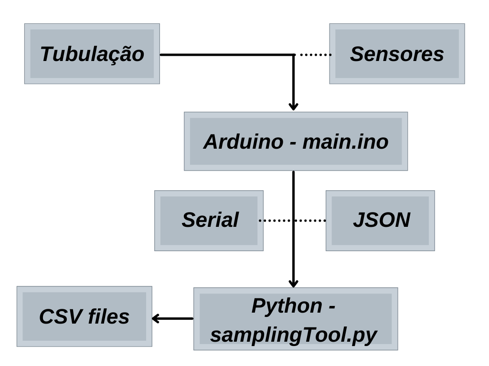
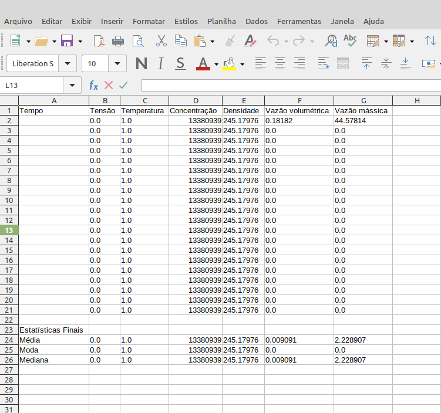
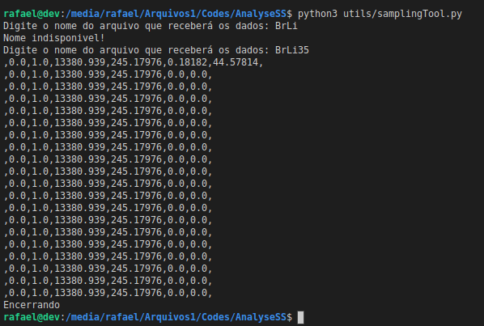

# AnalyseSS - Analisador de propriedades de soluções salinas
Skills utilizadas:

1. Elaboração de sistema utilizando um microcontrolador;
1. Utilização de sensores;
1. Comunicação serial via JSON;
1. Tratamento de JSON utilizando python;
1. Controle, criação e formação de arquivos em python;
1. Calculos estatísticos em python.

## Descrição

O objetivo do projeto é calcular e obter as seguintes propriedades do fluxo de uma solução salina:
* Temperatura
* Concentração do sal
* Densidade do fluido
* Vazão volumetrica do fluido
* Vazão massica do fluido

Para atingir esse objetivo são utilizados sensores de temperatura, vazão e concentração. Esses sensores são ligados a um Arduino Uno que fica responsavel por todo o calculo das informações. As informações são então enviadas para um computador onde são processadas por um script e salvas no formato CSV.

---

## Files

### main
    
    Código carreagado no arduino que é responsavel por fazer a leitura dos sensores, calcular e processar os dados para envia-los via serial no formato JSON para o computador.

São utilizadas as seguintes bibliotecas:

* ADS1X15: Para controle de um conversor analógico digital; 
* OneWire:  Para comunicação com o sensor de temperatura;
* DallasTemperature: Para utilização do sensor de temperatura.
 
### samplingTool
    
    Script responsável por receber o JSON via serial, processa-lo e salvar as informações obtidas de maneira ordenada em um arquivo CSV.

    São utilizadas as seguintes bibliotecas:

* pyserial: Para comunicação e leitura da porta serial;
* json: Para processar as informações recebidas no formato JSON;
* statistics: Para realizar os calculos de média, moda e mediana.

---
## Output

O arquivo CSV de saída tem o seguinte formato:

Enquanto o script está rodando, para fins de controle, as informações são mostradas no terminal no seguinte formato:

[Back To The Top](#read-me-template)

---